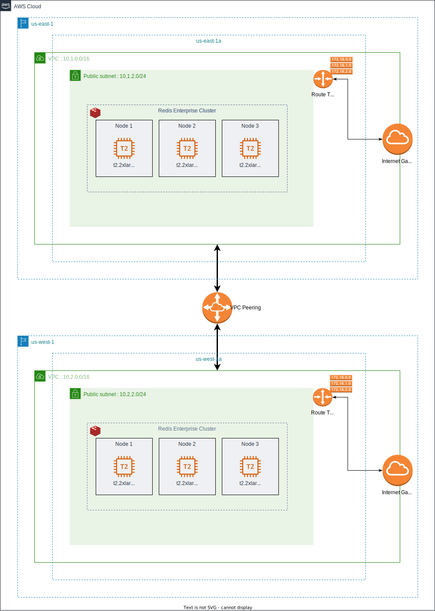

= Cross-Region: Basic Configuration

This configuration consists of a cluster of nodes that are deployed within an AWS data center in the ```us-east-1``` region, connected to another cluster of nodes that are deployed within the ```us-west-1``` region. Each cluster is deployed in one availability zone.



Between these two clusters, a VPC peering connection is established between the two VPCs to enable you to route traffic between them using private IPv4 addresses. Instances in either VPC can communicate with each other as if they are within the same network.

In AWS, a VPC peering is bidirectional. Unlike GCP or Azure, you need only to create a Peering from the source VPC and to accept it in the sink VPC. VPCs across accounts and AWS Regions can also be peered together. 


IMPORTANT: VPC peering is point-to-point connectivity, and it does not support transitive routing. For example, if you have a VPC peering connection between VPC A and VPC B and between VPC A and VPC C, an instance in VPC B cannot transit through VPC A to reach VPC C. To route packets between VPC B and VPC C, you are required to create a direct VPC peering connection.


If you run with the `rs-client` block, a bastion machine will be created on the same colocated network & infrastructure.

You can create the same configuration in a private mode by activating the flag `private_conf=true`. In this case, the cluster will be created in a private subnet and will be reachable only by a bastion node. This configuration, will create a NAT (Network Address Translation) gateway, so the clusters' nodes in the private subnet can connect to services outside the VPC (e.g. downloading packages) but external services cannot initiate a connection with those instances.


This configuration fits scenarii that need geographical distribution of data like, Active-Passive or Active-Active:

== Unidirectional Replication (Active-Passive)

With Redis Enterprise you can create Active-Passive Geo-Distributed deployments using the “replica-of” capability. This unidirectional replication capability allows you to synchronize data between source and destination databases, placing the data physically closer to the user for low-latency read access. All writes to the source database are replicated to destination databases. However, writes to the destination databases are not replicated back to source databases.

This figure illustrates Active-Passive Geo-Distributed topology using replica-of:

image:https://redis.com/wp-content/uploads/2018/10/diagram-active-passive-geo-distribution-2018.png?_t=1541023058&&auto=webp[Active-Passive]

== Bi-Directionnal Replication (Active-Active)

An Active-Active architecture is a data resiliency architecture that distributes the database information over multiple data centers via independent and geographically distributed clusters and nodes. It is a network of separate processing nodes, each having access to a common replicated database such that all nodes can participate in a common application ensuring local low latency with each region being able to run in isolation.

Active-Active Architecture or an Active-Active Geo-Distributed topology is achieved by implementing CRDTs (conflict-free replicated data types) in Redis Enterprise using a global database that spans multiple clusters. This is called a “conflict-free replicated database” or “CRDB.”

CRDB provides three fundamental benefits over other geo-distributed solutions:

- It offers local latency on read and write operations, regardless of the number of geo-replicated regions and their distance from each other.
- It enables seamless conflict resolution (“conflict-free”) for simple and complex data types like those of Redis core.
- Even if most of the geo-replicated regions in a CRDB (for example, 3 out of 5) are down, the remaining geo-replicated regions are uninterrupted and can continue to handle read and write operations, ensuring business continuity.

image::https://redis.com/wp-content/uploads/2020/05/diagram-active-active-peer-replication-2018.png?&auto=webp&quality=85,75&width=1200[Active-Active]