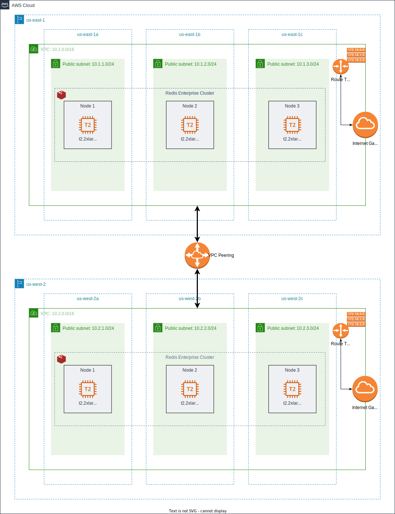
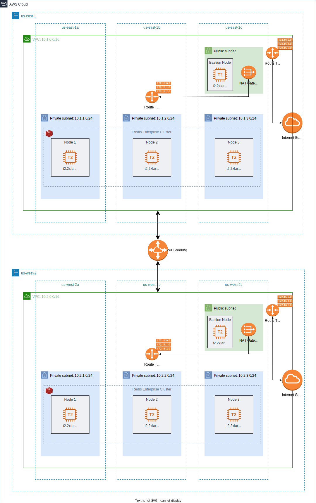

= Cross-Region: Rack Aware Configuration

This configuration consists of a cluster of nodes that are deployed within an AWS data center in the ```us-east-1``` region, connected to another cluster of nodes that are deployed within the ```us-west-2``` region. Each cluster is deployed in a distinct availability zone.

A rack-zone ID is assigned to each node. This ID is used to map the node to a physical rack or logical zone. The cluster can then ensure that master shards, corresponding replica shards, and associated endpoints are placed on nodes in different racks/zones.



If you run with the `rs-client` block, a bastion machine will be created on the same colocated network & infrastructure.

You can create the same configuration in a private mode by activating the flag `private_conf=true`. In this case, the cluster will be created in private subnets (one in each availability zone) and will be reachable only by a bastion node. This configuration, will create a NAT (Network Address Translation) gateway, so the clusters' nodes in the private subnets can connect to services outside the VPC (e.g. downloading packages) but external services cannot initiate a connection with those instances.

