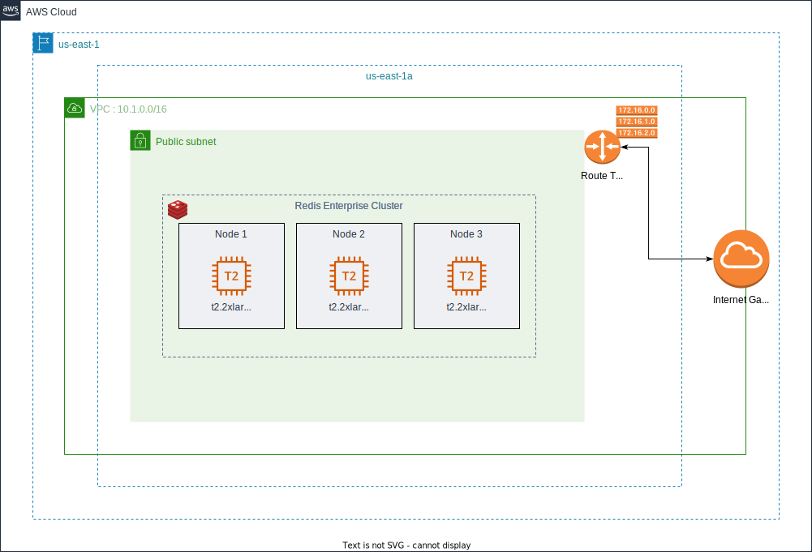
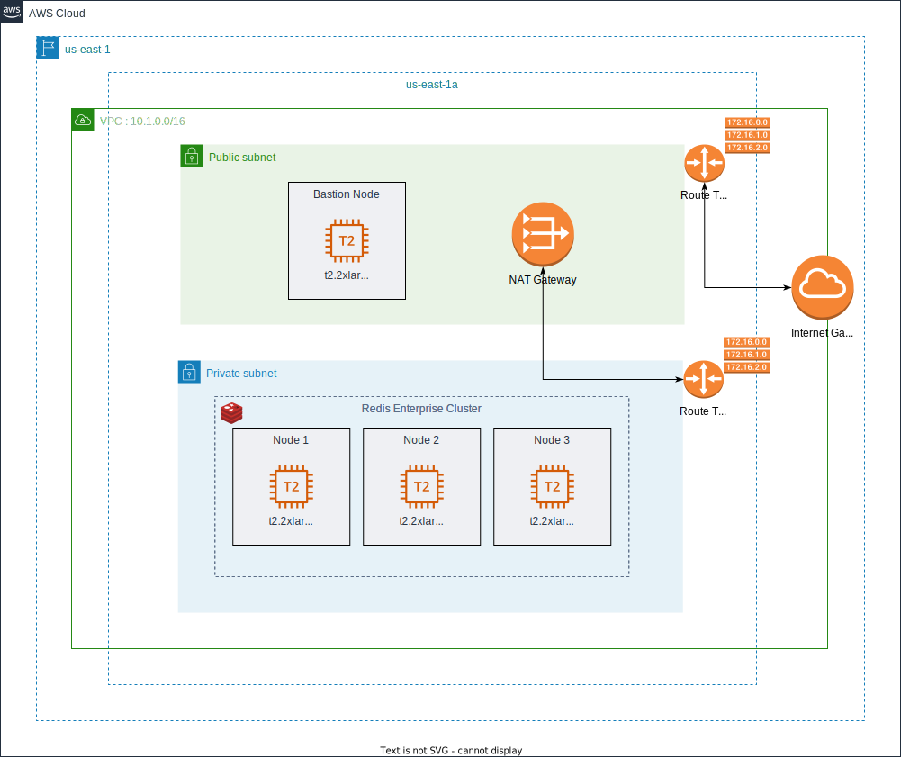

= Mono-Region: Basic Configuration

In Redis Enterprise, a cluster is a set of cloud instances, virtual machine/container nodes, or bare-metal servers that let you create any number of Redis databases in a memory/storage pool that’s shared across the set. The cluster doesn’t need to scale up/out (or down/in) whenever a new database is created or deleted. A scaling operation is triggered only when one of the predefined limit thresholds has been reached, such as memory, CPU, network, and storage IOPS.

Redis Enterprise cluster is built on a complete separation between the data-path components (i.e proxies and shards) and the control/management path components (i.e. cluster-management processes), which provides a number of significant benefits:

image::https://redis.com/wp-content/uploads/2018/10/diagram-cluster-architecture-symmetric-architecture-2018.png?_t=1541010738&&auto=webp&quality=85,75&width=1200[Clustering]

The Basic configuration consist of a Redis Enterprise Cluster of 3 nodes deployed in one availability zone within a single AWS region.

If you run with the `rs-client` block, a bastion machine will be created on the same colocated network & infrastructure.

You can create the same configuration in a private mode by activating the flag `private_conf=true`. In this case, the cluster will be created in a private subnet and will be reachable only by a bastion node. This configuration, will create a NAT (Network Address Translation) gateway, so the clusters' nodes in the private subnet can connect to services outside the VPC (e.g. downloading packages) but external services cannot initiate a connection with those instances.

