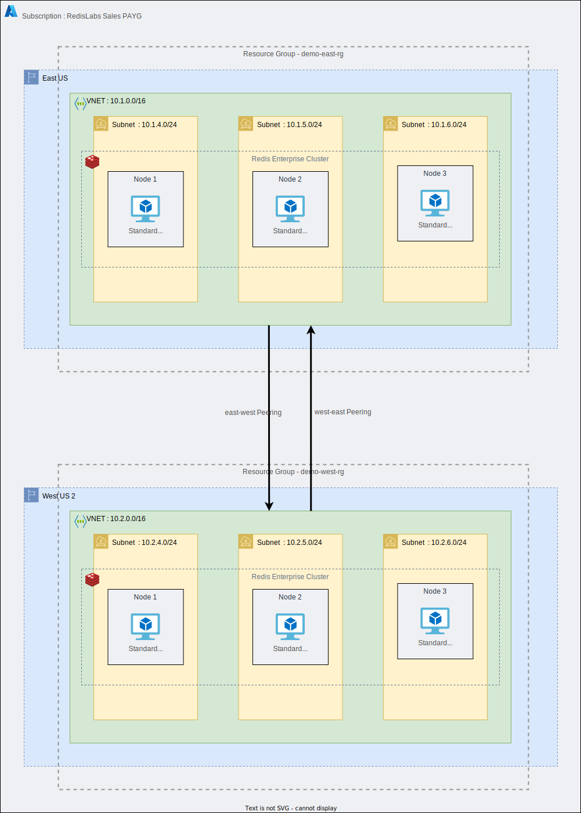

= Cross-Region: Rack Aware Configuration

This configuration consists of a cluster of nodes that are deployed within an Azure data center in the ```East US``` region, connected to another cluster of nodes that are deployed within the ```West US 2``` region. Each cluster is deployed in a distinct availability zone.

A rack-zone ID is assigned to each node. This ID is used to map the node to a physical rack or logical zone. The cluster can then ensure that master shards, corresponding replica shards, and associated endpoints are placed on nodes in different racks/zones.

