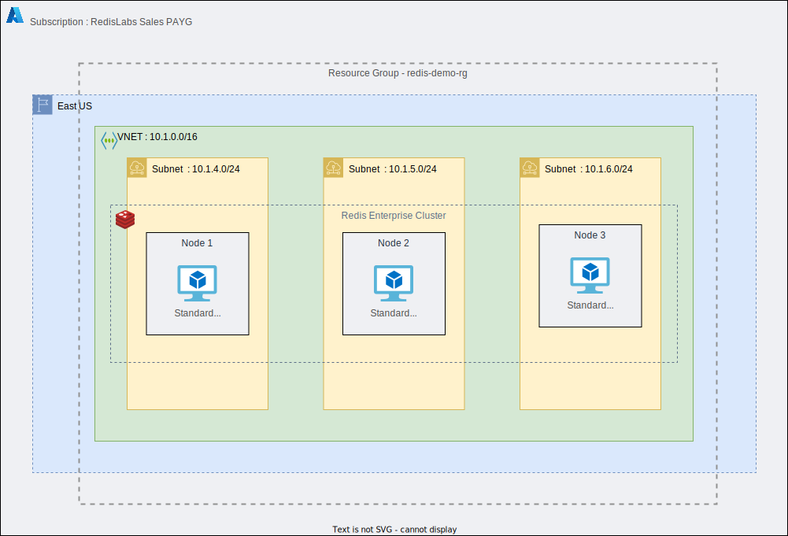

= Mono-Region: Rack Aware Configuration

Rack-zone awareness is a Redis Enterprise feature that helps to ensure high-availability in the event of a rack or zone failure.

When you enable rack-zone awareness in a Redis Enterprise Software cluster, you assign a rack-zone ID to each node. This ID is used to map the node to a physical rack or logical zone. The cluster can then ensure that master shards, corresponding replica shards, and associated endpoints are placed on nodes in different racks/zones.

image::https://redis.com/wp-content/uploads/2018/10/diagram-highly-available-multi-AZ-2018.png?_t=1541019045&&auto=webp&quality=85,75&width=800[RZA]

In the event of a rack or zone failure, the replicas and endpoints in the remaining racks/zones are promoted. This ensures high availability when a rack or zone fails.

The Rack Aware configuration consist of a Redis Enterprise Cluster of 3 nodes deployed in distinct availability zones within a single Azure region.

If you run with `client_enabled=true` a client machine with memtier CLI already installed on it, will be created on the same colocated network & infrastructure.